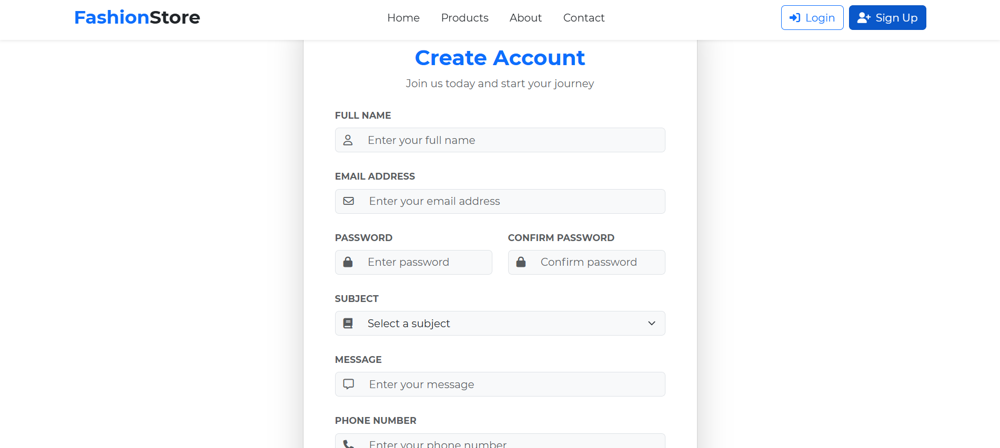
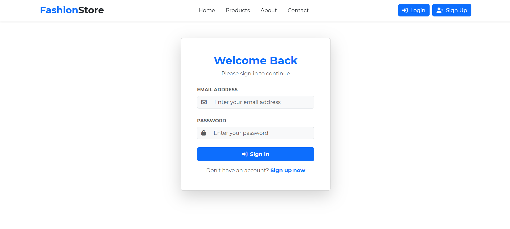
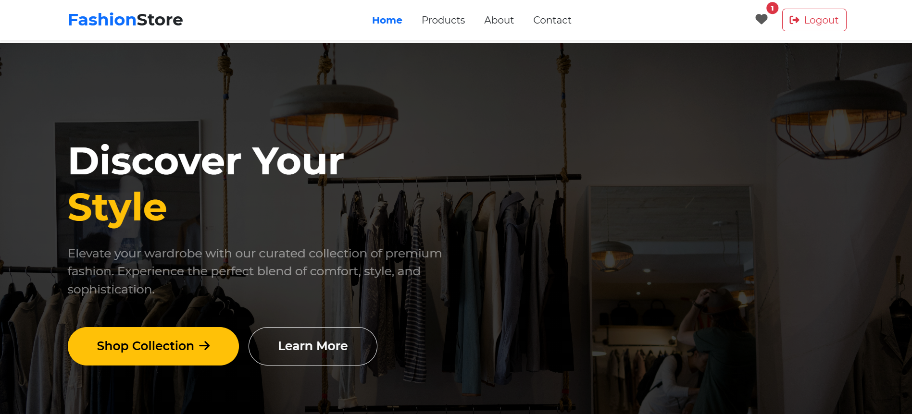
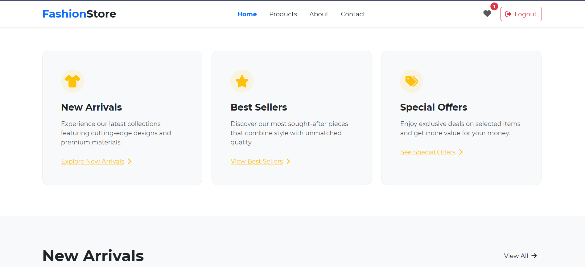
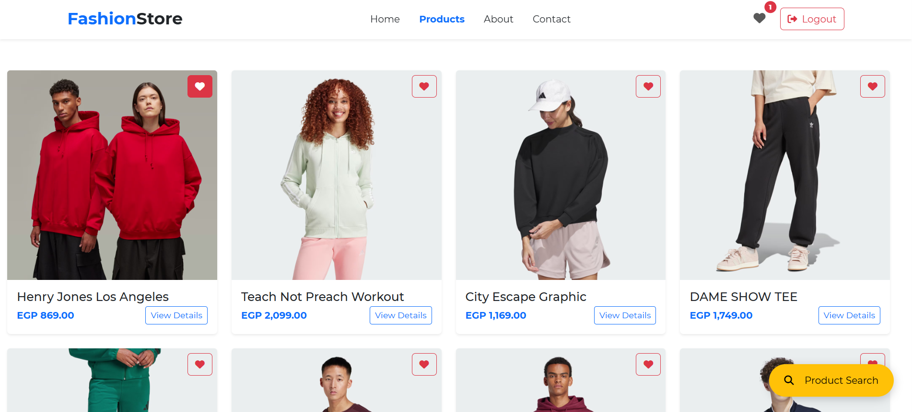
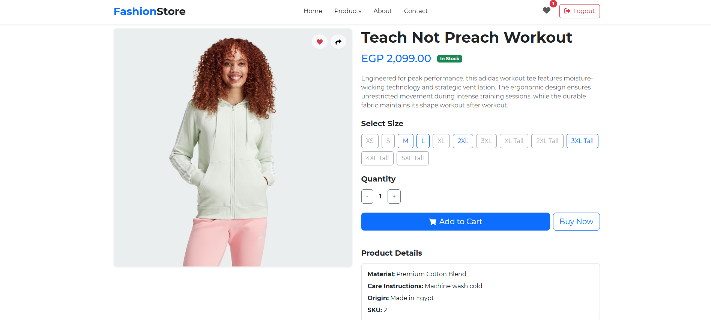
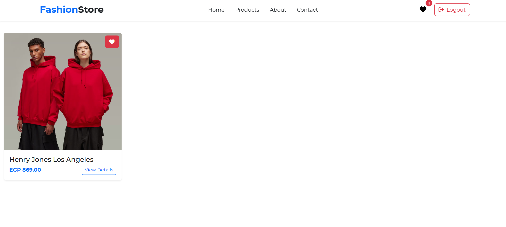
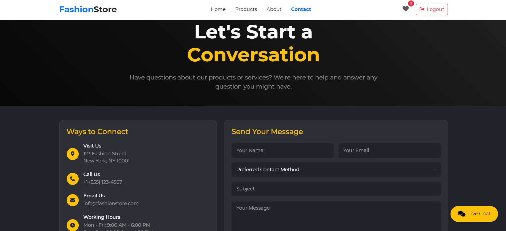

# 🛍️ Fashion Store

**Fashion Store** is a complete and modern e-commerce platform for selling fashion and clothing items. It provides a smooth and user-friendly shopping experience.

---

## 🌟 Features

### 🛒 Product Management
- Dynamic product catalog with advanced search and filtering.
- Interactive product detail page with specs, images, and live availability.
- Add to cart, wishlist support, and social sharing.

### 👤 User Account Management
- Login and register using email and password.
- Personal dashboard for order tracking and wishlist management.

### 🎯 Product Organization
- Advanced filters by size, price, and availability.
- Showcasing featured products and related suggestions for better conversions.

### 📦 Inventory Management
- Real-time inventory updates with stock-out alerts.
- Support for product variants such as size and color.

### 🚀 Performance Optimization
- Lazy loading for images to improve performance.
- Responsive UI optimized for all devices.

---

## 💻 Tech Stack

- **Frontend**: [React.js](https://reactjs.org/), [Bootstrap](https://getbootstrap.com/)
- **Backend / API**: [JSON Server](https://github.com/typicode/json-server) (RESTful API)
- **Version Control**: Git & GitHub

---

## 📸 Screenshots

  
  
  
  
  
  
  
  

  

---

## 🚀 Getting Started

### 1. Clone the repository

```bash
git clone https://github.com/AhmedKamalMo/ecommerce_website_react.git
